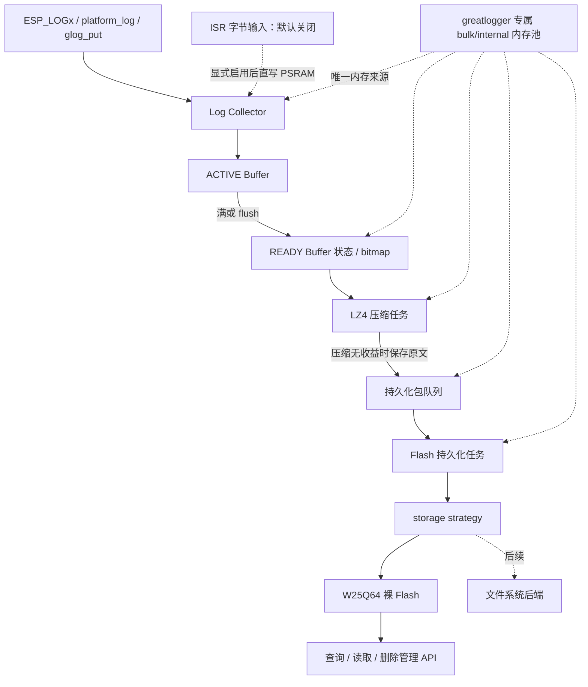

# greatlogger（glog）日志模块技术方案

> 文档状态：技术方案已确认；阶段 A 已实施，阶段 B～E 尚未实施。
>
> 设计依据：`docs/日志系统.md`，基线 SHA-256 为
> `be5bd7626b377d80e2b280d098445f5c76226d6c49257b3951f499a955c12199`。
>
> 第 2 节记录阶段 A 实施前基线，其余章节描述已确认契约与后续落地方案。原始规范文件不得由本方案修改。

## 1. 目标、范围与约束

greatlogger 面向有较充足 RAM/PSRAM、需要将运行日志压缩后长期保存在 Flash 的 ESP32 设备。它不是 EasyLogger 一类“每次打印同步写 Flash”的实现，而是一个有界、异步的流水线：前台快速采集，后台压缩，最后按擦除块持久化。

本方案的交付目标如下：

- 保留原规范定义的“日志缓存 + 日志压缩 + 日志存储”异步架构。
- 复用现有的 ringbuffer、链表队列、CRC32、lwmem、LZ4 和 FreeRTOS 平台适配骨架。
- 通过策略接口隔离 Flash、压缩、时间和平台能力，使 W25Q64 裸 Flash 可先落地，文件系统后端可后续增加。
- greatlogger 的全部动态对象和工作内存只允许通过组件专属内存池接口取得，不占用或扰动其他模块的运行期系统堆。
- 对内存池、队列、任务和 Flash 区域设置硬上限，业务路径不等待压缩、擦除或写入。
- 明确断电恢复、满盘、校验失败、时钟回拨、并发和 ISR 场景的处理规则。
- 数据采集默认只接受普通任务日志；ISR 采集由用户显式开启，开启后强制使用双 Buffer。

本方案不包含以下工作：

- 阶段 A 不接管业务日志、不烧录，也不执行会擦除 Flash 的测试。
- 首期不实现文件系统存储后端、日志服务端协议、加密或跨设备通用日志解析工具。
- 上传任务、HTTP 协议和上传状态管理暂不设计、不实现；当前流水线以 Flash 持久化成功为终点。

原规范“内存：使用线程池”的表述，结合“用户定义总大小、避免内存碎片”和现有 lwmem 实现，本文按“固定大小内存池”理解；任务模型仍是两个后台工作任务，并不是线程池。此解释属于审核项。

“所有行为在内存池内进行”在本文中定义为：除调用方提供的专属 backing region 和编译期固定的
singleton 状态外，组件的 context、compressor、backend workspace、队列节点、任务栈/TCB、mutex
control block、collector、packet 和 scratch Buffer 均从 `glog_mem_pool_*` 接口取得；
代码中禁止直接调用 libc heap 或 FreeRTOS 动态对象创建接口，也不提供系统堆 fallback。

## 2. 阶段 A 实施前代码框架基线

### 2.1 目录与构建边界

当前组件的有效结构如下。第三方库自带的大量文档、示例、测试和多平台工程只作为上游源码随仓库保存，不属于 greatlogger 的运行时代码。

```text
components/greatlogger/
├── CMakeLists.txt                 # ESP-IDF 组件注册，已列入全部现有本地源文件
├── README.md                      # 本技术方案
├── glog.h                         # 当前顶层配置宏和公共 API 声明
├── glog.c                         # 0 行，顶层编排尚未实现
└── port/
    ├── inc/
    │   ├── compress.h             # 可替换压缩后端接口
    │   ├── crc32.h                # CRC32 接口
    │   ├── mempool.h              # 内存池接口和统计
    │   ├── platform.h             # mutex、任务、任务通知适配
    │   ├── queue.h                # 线程安全链表队列接口
    │   └── ringbuffer.h           # 单线程字节环形缓冲接口
    ├── src/
    │   ├── compress.c             # 默认 LZ4 block 压缩/解压实现
    │   ├── crc32.c                # CRC32/IEEE 802.3 实现
    │   ├── mempool.c              # lwmem + PSRAM 内存区封装
    │   ├── platform.c             # FreeRTOS 平台实现
    │   ├── queue.c                # 带 mutex 的链表队列实现
    │   └── ringbuffer.c           # 无锁、单线程环形缓冲实现
    └── 3rd/
        ├── lwmem/                 # LwMEM 2.2.4，MIT
        └── lz4/                   # LZ4 1.10.0；运行时只编译 lib/lz4.c
```

`CMakeLists.txt` 当前实际编译：`glog.c`、6 个 `port/src` 文件、`lwmem.c` 和 `lz4.c`；依赖 `platform`、`platform_log`，私有依赖 FreeRTOS。LZ4 的 `programs/`、`tests/`、`examples/` 以及 lwmem 的上游示例和测试均未参与固件构建。

当前 `INCLUDE_DIRS` 将组件内部适配层和第三方头文件作为公共包含目录暴露。实施阶段应仅公开 `glog.h` 所在目录，把 `port/inc` 和第三方目录改为私有包含目录，避免 `platform.h`、`queue.h` 等通用文件名与其他组件冲突。

### 2.2 已有能力与成熟度

| 子模块 | 当前已有能力 | 当前限制 | 成熟度 |
| --- | --- | --- | --- |
| 顶层 `glog` | 声明初始化、写入、查询、删除 API；给出内存池和 Buffer 宏 | `glog.c` 为空，所有顶层 API 均无实现 | 未实现 |
| 压缩 | 公开 backend ops；默认 LZ4；支持 bound、压缩和安全解压；可注入自定义后端 | compressor 对象用系统 `calloc/free`；压缩等级对默认 LZ4 尚不起作用 | 基础能力已实现 |
| CRC32 | 标准 CRC32/IEEE 802.3 查表实现 | 通用函数名可能冲突；自定义开关未形成完整注入接口 | 基础能力已实现 |
| 内存池 | 不透明句柄；malloc/calloc/realloc/free；统计；lwmem 支持 mutex | 后端 ops 仅在 `.c` 内，公共层不能真正替换；原始内存固定由 `ps_calloc()` 从 PSRAM 申请；池大小必须不小于 16 KiB 且为 2 的幂 | 部分实现 |
| 链表队列 | FIFO put/get/clean/deinit；mutex 保护；长度和判空 | 节点使用系统 `malloc/free`，没有有界深度；clean 只释放节点、不释放业务数据；`QUENE` 拼写遗留 | 部分实现 |
| ringbuffer | power-of-two 容量、跨尾部拷贝、长度/余量查询 | 单线程且无参数校验；用 `uint16_t` 索引；保留一个空槽，32 KiB backing 实际可用 32767 字节 | 基础能力已实现 |
| 平台层 | FreeRTOS mutex、动态任务、普通/ISR 任务通知和超时等待 | 通知值使用 overwrite，只能作为“唤醒信号”；未提供临界区、静态任务、时间、Flash 和 ISR yield 封装 | 部分实现 |
| Flash 存储 | 无 | 无存储策略接口、包格式、扫描、写入、删除或断电恢复 | 未实现 |
| 工作任务 | 平台层可创建任务 | 压缩任务、持久化任务、退出握手均未实现 | 未实现 |
| 测试 | 第三方目录包含上游测试 | greatlogger 自身没有单元、故障注入或真机测试 | 未实现 |

组件目录约 21 MiB，主要来自完整引入的 LZ4/lwmem 上游仓库。首期不要求清理这些文件；发布或组件化时可只保留许可证、运行时源码与必要头文件，避免把上游 GPL 工具目录误作为固件链接内容。当前固件只链接 LZ4 `lib/` 下 BSD-2-Clause 代码和 MIT 的 lwmem。

### 2.3 当前接口定义

`glog.h` 当前声明的顶层接口如下，但因为 `glog.c` 为空，不能视为可用 API：

| 当前接口 | 声明意图 | 需要补齐的问题 |
| --- | --- | --- |
| `glog_init(void)` | 初始化全局 logger | 无配置参数、无返回状态，无法注入 Flash 区域和后端 |
| `glog_deinit(void)` | 反初始化 | 无 drain/flush 超时及失败反馈 |
| `glog_put(uint8_t *, size_t)` | 将字节写入 collector | 无 `const`、无写入结果、无 ISR 专用契约 |
| `glog_get_log_count(void)` | 返回 Flash 中压缩包数量 | 无存储错误表达 |
| `glog_get_log_data(uint8_t **, size_t *)` | 获取最旧包但不删除 | 没有序号输出，返回值语义和内存所有权不明确 |
| `glog_del_log(size_t)` | 按序号删除 | 无成功/失败状态，序号宽度未固定 |
| `glog_delete_all_log(size_t)` | 清空全部日志 | `seq` 参数与“全部删除”语义矛盾 |

辅助层当前已形成以下接口族：

- `glog_compressor_*()`：压缩器创建、销毁、bound、压缩、解压和默认 backend 获取。
- `glog_mem_pool_*()`：池创建/销毁、分配/释放、safe 版本和统计。
- `glog_queue_*()`：链表 FIFO 生命周期和读写。
- `glog_rb_*()`：环形缓冲初始化、读写、清空、长度和余量。
- `glogPlat_*()`：mutex、任务创建/删除、任务通知和等待。
- `crc32()`：一次性 CRC32 计算。

当前配置宏也仍处于骨架状态：`ENABLE_CUSTOM_QUENE` 和
`ENABLE_CUSTOM_RINGBUFFER` 只决定默认 `.c` 是否编译函数体；compressor 已采用运行时 backend，
不依赖 `ENABLE_CUSTOM_COMPRESS`；`ENABLE_CUSTOM_MEM_POOL` 尚未被实现引用；CRC32 源文件没有包含
`glog.h`，只能依赖构建系统额外定义同名宏。`glog.h` 自身还缺少 `stdint.h` 和 C++ linkage guard。
这些问题应在阶段 A 统一收敛，不能继续让“配置宏存在”等同于“自定义能力可用”。

当前没有仓库内业务代码调用 `glog_*`。`app/CMakeLists.txt` 已声明依赖 `greatlogger`，因此可以在首次实施时先修正尚未落地的公共接口，再接入业务，不需要维护一个已被使用的 ABI。

### 2.4 仓库内可用适配面

- `components/platform/platform.h` 提供 `ps_malloc/ps_calloc/ps_realloc`，当前 lwmem 原始区域由 `ps_calloc()` 放入 PSRAM。项目 `sdkconfig` 已启用 PSRAM capability allocation。
- `components/platform/platform_log` 将 `log_error/log_warn/log_info/log_debug/log_verbose` 映射到 ESP-IDF `ESP_LOGx`，统一附带函数名和行号。
- `components/services/system_time` 在启动时用固件编译时间初始化 Unix 时间，联网后由 SNTP 校时。`app_main()` 当前先调用 `system_time_init()`，可满足日志 RTC 初值需求。
- `components/drivers/storage/w25q64` 提供 8 MiB 外部 Flash 的 read/write/4 KiB sector erase；写接口会按 256 B page 自动拆分。驱动本身不可重入，必须由上层串行化。
- 当前 W25Q64 仅用于启动期通信测试，测试会擦写最后一个 4 KiB sector（`0x7FF000`）并在结束时释放软件 SPI。该测试句柄不能直接作为 logger 的长期存储句柄。
- `partitions.csv` 描述 ESP32-S3 主 Flash 分区，不管理外接 W25Q64。若 greatlogger 使用外接 W25Q64，不需要新增 ESP-IDF partition；若改用片内 Flash，则必须另行设计专用 data partition。

## 3. 原规范逐项映射

| 原规范核心规则 | 本方案落点 | 兼容结论 |
| --- | --- | --- |
| 异步“缓存 + 压缩 + 存储” | collector 只做有界内存拷贝；compression task 和 persistence task 后台处理 | 保留 |
| 用户定义总内存，避免碎片 | 使用 greatlogger 专属 lwmem 内存域；bulk/internal 两个 region 由内部板级 adapter 提供，全部对象、队列节点和任务资源从对应 pool 取得 | 保留并收紧 |
| 裸 Flash，由用户提供 read/write/erase、起始地址、总大小和擦除单位 | 私有 `glog_storage_ops_t` 与 region geometry 由板级 adapter 注入；首个仓库适配器映射 W25Q64 | 保留 |
| 文件系统版后续补充，策略模式解耦 | 核心只依赖 storage ops；LittleFS backend 后续独立实现 | 保留 |
| 压缩可自定义，默认 LZ4 | 直接复用现有 compressor backend，NULL backend 表示默认 LZ4 | 保留 |
| ringbuffer、链表队列、CRC32 | ring backing 和链表节点都由 pool 预分配；CRC32 改为 `glog_crc32_*` 专用命名头 | 保留并消除冲突 |
| 压缩任务接收 Buffer 满事件 | Buffer 标为 READY 后以任务通知唤醒压缩任务；双 Buffer 状态/READY bitmap 才是事实来源 | 保留并避免通知覆盖丢事件 |
| 持久化任务接收压缩包并写 Flash | 压缩包进入 persist queue，再唤醒持久化任务 | 保留 |
| 包由固定参数区 + 动态数据区组成，按擦除块向上取整 | 参数头固定 28 B；数据区为固定 packet header + 动态 payload；严格使用 ceil 公式 | 保留 |
| 参数依次包含 block_seq、block_count、RTC_time、CRC32、magic | Flash 参数头只包含且按此顺序排列这五项 | 完全保留 |
| block_seq 标识块位置并可用于地址转换 | 使用 `uint64_t` 单调逻辑块序号，通过对 region 块数取余映射物理块；映射可跨物理末尾回到 region 首部 | 保留并明确环形语义 |
| CRC32 校验前三个参数 | header CRC 只覆盖前三项的固定小端序字节 | 完全保留 |
| RTC 必须大于前一个包，否则前值 + 1 | 持久化任务串行执行 `max(now, last_rtc + 1)` | 完全保留 |
| magic 快速定位参数区 | 固定 magic，先筛选 magic，再校验 header CRC 和范围 | 保留 |
| 单/双 Buffer，尽量不阻塞业务 | 普通任务模式支持 1 或 2 个 PSRAM Buffer；ISR 默认关闭，开启 ISR 后只允许 2 个 Buffer；无 FREE Buffer 时丢弃并计数 | 保留并明确模式约束 |
| Flash 后可进入 HTTP 上传任务 | 本期明确止于 Flash 持久化；保留通用查询/读取/删除管理能力，不设计上传任务或网络协议 | 延后 |

## 4. 总体架构



架构分为四层：

1. **公共门面层**：生命周期、写入、flush、查询、读取、删除和统计；不暴露 FreeRTOS、lwmem 或 W25Q64 类型。
2. **流水线核心层**：collector Buffer 状态机、READY bitmap、pool-backed 链表队列、压缩与持久化任务、背压和错误状态。
3. **格式与存储层**：压缩包编码、Flash 参数头、块分配、扫描恢复、提交和回收。
4. **策略与平台层**：压缩、内存、Flash、RTC、mutex、任务、临界区和 ESP-IDF 日志接入。

核心数据所有权必须单向转移：

```text
FREE -> ACTIVE -> READY -> COMPRESSING -> PERSIST_PENDING -> FREE
```

任何阶段只有一个所有者。队列只传递描述符或 Buffer 所有权，不复制不明确的裸指针；失败路径必须把所有权归还到池或 FREE 列表。

## 5. 公共 API 方案

### 5.1 API 调整原则

公共 API 采用最小门面，业务调用方只接触生命周期、日志收集和最旧日志包消费：

- 所有可能失败的接口返回统一 `glog_status_t`。
- `glog.h` 不公开配置结构、压缩格式、存储策略、RTC、内存池、任务或统计结构。
- `glog_init()` 无参数，使用组件内部默认配置和板级 adapter；Flash 区域仍必须在内部 adapter 中明确指定，禁止猜测地址。
- 输入数据使用 `const void *`；日志包序号固定为 `uint64_t`。
- 最旧日志包复制到调用方 Buffer，不返回组件内部指针；容量不足时返回所需长度。
- 读取不隐式删除；调用方用读取所得 `seq` 确认删除当前最旧包，避免删错记录。
- ISR、flush、诊断统计和批量管理属于内部能力，首期不进入公共 API。

### 5.2 建议接口轮廓

阶段 A 收敛后的公共接口如下：

```c
typedef uint64_t glog_seq_t;

typedef enum {
    GLOG_OK = 0,
    GLOG_ERR_INVALID_ARG,
    GLOG_ERR_INVALID_STATE,
    GLOG_ERR_NO_MEMORY,
    GLOG_ERR_BUFFER_TOO_SMALL,
    GLOG_ERR_STORAGE_FULL,
    GLOG_ERR_STORAGE_IO,
    GLOG_ERR_CORRUPT,
    GLOG_ERR_NOT_FOUND,
    GLOG_ERR_TIMEOUT,
} glog_status_t;

glog_status_t glog_init(void);
glog_status_t glog_deinit(void);
glog_status_t glog_put(const void *data, size_t length);
glog_status_t glog_get_oldest(
    void *buffer,
    size_t capacity,
    size_t *package_size,
    glog_seq_t *seq
);
glog_status_t glog_delete_oldest(glog_seq_t seq);
```

接口语义：

- `glog_put()` 是非阻塞、单次写入原子的 best-effort 接口。成功表示整段数据已进入采集路径；资源不足时整段丢弃并更新统计，不产生半条日志。
- 单次输入不得超过一个 collector Buffer 的有效容量；过长输入返回 `GLOG_ERR_INVALID_ARG`。格式化日志接入层应设置单行上限并记录截断次数。
- `glog_get_oldest()` 返回内部定义的完整、自描述日志包。`package_size` 和 `seq` 必填；Buffer 缺失或容量不足时返回 `GLOG_ERR_BUFFER_TOO_SMALL`，并通过 `package_size` 告知所需容量。
- `glog_delete_oldest()` 只删除当前最旧且序号匹配的包；Flash 擦除成功后才更新内部索引。
- 获取和删除不得从 ISR 调用。ISR 采集若后续启用，仅由组件内部日志接入层使用。

## 6. 配置与策略接口

### 6.1 专属内存池

greatlogger 的内部板级 adapter 必须提供生命周期覆盖 `glog_init()` 到 `glog_deinit()` 的独占 backing region；
组件不再自行调用 `ps_calloc()` 从共享堆临时取得内存。collector 及日志数据统一放入 PSRAM bulk
region，普通任务和启用后的 ISR 都可直接写该 region；平台要求必须位于内部 SRAM 的静态控制对象
使用 internal region。两个 region 都由同一组 `glog_mem_pool_*` 接口管理：

```c
typedef struct {
    void *bulk_region;          /* PSRAM：collector、packet、workspace、普通 scratch */
    size_t bulk_region_size;
    void *internal_region;      /* 内部 SRAM：静态 RTOS 控制对象 */
    size_t internal_region_size;
} glog_memory_config_t;
```

内存池接口需从“内部申请 backing”调整为“绑定调用方 region”：

```c
glog_mem_pool_t *glog_mem_pool_create_from_region(
    void *region,
    size_t region_size,
    void *pool_control_storage,
    size_t pool_control_storage_size
);

void *glog_mem_pool_malloc(glog_mem_pool_t *pool, size_t size);
void *glog_mem_pool_calloc(glog_mem_pool_t *pool, size_t count, size_t size);
void *glog_mem_pool_realloc(glog_mem_pool_t *pool, void *ptr, size_t size);
void glog_mem_pool_free(glog_mem_pool_t *pool, void *ptr);
```

硬性规则如下：

- `bulk_region` 与 `internal_region` 必须非空、互不重叠并满足 lwmem 对齐和最小尺寸要求；初始化失败时不得退回系统堆。
- pool control storage 使用调用方 region 的保留前缀或编译期固定 singleton 空间，不能通过 `malloc/calloc` 创建。
- compressor 对象、backend context 和 workspace 必须由创建者传入的 `glog_mem_pool_t` 分配；backend 的 `destroy()` 只能归还该 pool，不能调用 `free()`。
- `glog_queue_init()` 必须接收 pool 和最大深度，在初始化时从 pool 预分配全部链表节点；`put/get` 只在 free-list 与 ready-list 间移动节点，不得在运行期申请系统内存。
- queue 只拥有链表节点，不隐式释放 `data`；data 的所有权仍按流水线状态机转移，销毁队列前必须先 drain。
- collector backing、ring backing、packet、解压 scratch、恢复 scratch 以及核心创建的 storage wrapper/command 对象全部从 bulk pool 分配；用户传入的 storage context 仍由用户持有。
- 普通任务与 ISR 共用 pool 预分配的 PSRAM collector Buffer；ISR 不另设内部 SRAM 中转缓冲，也不在中断期间 malloc/free。
- 静态 mutex control block、任务 TCB 以及平台要求必须位于内部 RAM 的对象从 internal pool 分配。
- `glogPlat_task_create()` 和 `glogPlat_mutex_create()` 应替换为基于 `xTaskCreateStatic()`、`xSemaphoreCreateMutexStatic()` 的静态接口；任务栈也必须由 glog pool 提供，不能落入 FreeRTOS heap。
- glog 两个 pool 的 allocator lock 使用编译期静态 port lock 或 region 内预留的静态 mutex，解决“创建 pool 前先动态创建 mutex”的循环依赖。
- 内部诊断统计分别记录 bulk/internal 总量、当前余量和最低余量；任何系统 heap 调用都视为内存隔离测试失败，但统计结构不进入公共 API。
- `glog_mem_pool_destroy()` 只校验无未释放对象并解除 region 绑定，不释放调用方提供的 backing memory；backing ownership 始终属于调用方。

建议把 compressor 创建接口调整为显式接收 pool：

```c
glog_compressor_t *glog_compressor_create(
    glog_mem_pool_t *pool,
    const glog_compress_backend_ops_t *backend,
    const glog_compress_config_t *config
);
```

自定义 backend 的 `create()` 同样接收该 pool。默认 LZ4 本身不需要动态 workspace，但
`glog_compressor_t` 仍从 pool 创建，不能保留当前系统 `calloc/free` 实现。

### 6.2 Flash 抽象接口

```c
typedef struct {
    void *context;
    glog_status_t (*read)(
        void *context, uint32_t address, void *data, size_t length
    );
    glog_status_t (*write)(
        void *context, uint32_t address, const void *data, size_t length
    );
    glog_status_t (*erase)(
        void *context, uint32_t address, size_t length
    );
    glog_status_t (*sync)(void *context); /* 裸 NOR 可为 NULL */
} glog_storage_ops_t;

typedef struct {
    const glog_storage_ops_t *ops;
    uint32_t base_address;
    size_t region_size;
    size_t erase_size;
    uint8_t erased_value;
} glog_storage_config_t;
```

约束如下：

- 私有 `glog_storage_config_t` 是内部初始化必填项，板级 adapter 必须同时提供 `ops`、`context`、`base_address`、
  `region_size` 和 `erase_size`；greatlogger 不选择默认芯片，也不推断可写区域。
- `context` 及底层 Flash 设备由用户初始化并保持有效；greatlogger 只按 ops 契约访问，不依赖
  `w25q64_t`、`esp_partition_t` 或文件系统具体类型。
- storage callbacks 不得在调用期间从共享系统堆分配内存，也不得递归调用 greatlogger；所需 workspace 应由用户在 context 中预先提供。
- 所有地址都由核心计算为后端的绝对地址；每次调用前验证其位于
  `[base_address, base_address + region_size)`，并检查加法溢出。
- `region_size` 必须大于 0；`base_address` 和 `region_size` 必须按 `erase_size` 对齐，region 至少包含两个擦除块。
- `erase()` 的地址和长度都按擦除单位对齐；W25Q64 adapter 内部循环调用现有的 `w25q64_erase_sector()`。
- `write()` 不隐式擦除；核心保证只向已擦除区域编程。W25Q64 adapter 复用现有自动分页写能力。
- 核心持有 storage mutex，扫描、写和管理读取全部串行访问，以适配当前不可重入的 `sim_spi/w25q64`；删除/清空命令必须由 persistence task 执行，保持 Flash 只有一个修改者。
- 初始化没有合法 region 时必须失败，绝不使用“默认最后几个扇区”。

W25Q64 仅是仓库适配示例，不属于核心强依赖。其他裸 Flash 只要新增内部 adapter 提供等价 ops 和合法 region，
不修改 collector、packet 或持久化状态机即可接入。

### 6.3 RTC 策略

```c
typedef bool (*glog_rtc_read_fn)(void *context, uint64_t *unix_seconds);

typedef struct {
    glog_rtc_read_fn read;
    void *context;
} glog_rtc_config_t;
```

仓库默认 adapter 可用 `time(NULL)` 获取 Unix 秒。集成顺序必须保持
`system_time_init() -> storage init -> glog_init()`；SNTP 后续即使将系统时间向后校正，持久化任务仍执行：

```text
record_rtc = max(rtc_now, last_valid_record_rtc + 1)
```

时间只由单一持久化任务分配，因此不会因双核并发生成相同值。若 RTC 本次读取失败但 Flash 中已有合法记录，使用 `last + 1`；首次启动既无合法时间又无历史记录时初始化失败。`last == UINT64_MAX` 时进入故障态，禁止溢出回零。

### 6.4 主配置

私有 `glog_config_t` 包含 memory regions、storage、RTC、可选 compressor backend、collector 总大小、Buffer 数量、`enable_isr_capture`、两个队列深度、低流量 flush 周期、任务栈/优先级、满盘策略和是否镜像串口。它定义在 `private/glog_internal.h`，不向业务代码公开。

默认值由内部 `glog_config_init_defaults()` 集中生成；板级资源由内部 adapter 注入，不散落在公共头文件中：

| 项 | 建议默认值 | 说明 |
| --- | --- | --- |
| bulk pool | 256 KiB PSRAM | 与当前 `MEM_POOL_SIZE` 一致；128 KiB 是可选受测配置 |
| internal pool | 16 KiB 内部 SRAM | 静态 TCB/mutex 等控制对象；按栈水位复核 |
| collector 总 backing | 32 KiB PSRAM | 与原规范和当前 `RINGBUFFER_SIZE` 一致 |
| Buffer 数量 | 2 | 默认 2 × 16 KiB；任务模式可配置为单 Buffer |
| ISR 采集 | 关闭 | `enable_isr_capture=false`；启用时 Buffer 数量必须为 2 |
| compression queue | 2 | 普通任务模式引用 READY/snapshot；ISR 双 Buffer 通过 READY bitmap 交接 |
| persistence queue | 2 | 每项拥有一个池内 packet Buffer |
| flush 周期 | 5 s | 低流量时也能落盘；0 表示仅满/显式 flush |
| compression task | 4 KiB，`idle + 2` | 具体栈高水位以真机为准 |
| persistence task | 4 KiB，`idle + 1` | Flash 慢操作不应抢占关键业务 |
| 满盘策略 | 覆盖最旧包 | 保持日志持续写入，由内部持久化任务串行回收 |

初始化校验必须覆盖：

- 两个 region 地址合法、互不重叠且全部容量在 init 时可用；不得通过系统堆补足缺口。
- 每个 lwmem region 不小于 16 KiB 且为 2 的幂；若 internal pool 经实测需要小于 16 KiB，应先让内存池实现支持合法的小 region，而不是绕过接口。
- 单个 ring backing 为 2 的幂、至少 2 B，且不超过当前 `uint16_t` 索引可表达范围。
- Buffer 数量只能为 1 或 2；双 Buffer 总大小可整分。
- `enable_isr_capture=false` 为默认值；若设为 true，Buffer 数量必须为 2，两个 Buffer 都必须来自 PSRAM bulk pool，否则初始化失败。
- LZ4 `bound()`、packet header 和 Flash 参数头之和能放入 storage region。
- 队列深度非零，任务优先级小于 `configMAX_PRIORITIES`，所有必需 ops 非空。
- Flash region 不与适配器声明的保留区重叠；W25Q64 通信测试扇区必须排除。

### 6.5 CRC32 专用命名头

当前通用文件名 `crc32.h` 和全局符号 `crc32()` 都可能与 ESP-IDF 或其他组件冲突。实施时统一改为
greatlogger 专用命名空间：

```c
/* glog_crc32.h */
#ifndef GLOG_CRC32_H
#define GLOG_CRC32_H

#include <stddef.h>
#include <stdint.h>

typedef struct {
    uint32_t value;
} glog_crc32_context_t;

void glog_crc32_init(glog_crc32_context_t *context);
void glog_crc32_update(
    glog_crc32_context_t *context,
    const void *data,
    size_t length
);
uint32_t glog_crc32_final(glog_crc32_context_t *context);
uint32_t glog_crc32_compute(const void *data, size_t length);

#endif /* GLOG_CRC32_H */
```

源文件同步命名为 `glog_crc32.c`。组件内不得再导出或调用裸 `crc32()`；原 Flash 参数字段名
`crc32` 属于持久化格式的一部分，保持不变。CRC 算法仍为现有 CRC32/IEEE 802.3，改名不改变线上的
计算结果。上下文对象由调用方栈上提供或从 glog internal pool 取得，不使用系统堆。

## 7. 采集、Buffer 与并发设计

### 7.1 普通任务路径

`glog_put()` 只允许执行以下有界步骤：状态检查、进入短临界区、检查 ACTIVE Buffer 余量、一次内存拷贝、必要时轮转 Buffer、退出临界区和发送任务通知。它不得：

- 动态分配内存；
- 等待 mutex、队列空间、压缩、擦除或 Flash 写入；
- 调用会再次进入 greatlogger 的日志宏；
- 在高频正常路径打印诊断日志。

现有 ringbuffer 是单线程实现，因此不能让多个业务任务或 ISR 直接并发调用。核心需在其外层增加跨核临界区；mutex 只用于任务级管理 API，不能用于 ISR。临界区内不做格式化、压缩或 Flash 操作。

### 7.2 单/双 Buffer

普通任务模式支持单 Buffer 或双 Buffer，建议默认使用双 Buffer。双 Buffer 的状态为：一个 ACTIVE
接收日志，一个 FREE 等待切换。两个 backing 都在 init 时从 bulk pool 预分配到 PSRAM。ACTIVE 满、
flush 超时或显式 flush 时：

1. 在临界区内把 ACTIVE 标为 READY，并将 FREE 切为 ACTIVE。
2. 普通任务模式可把 READY 描述符放入 pool-backed compression queue；ISR 模式只设置两位 READY bitmap，不在中断里操作 mutex queue。
3. 用普通或 ISR-safe task notification 唤醒 compression task。
4. compression task 醒来后扫描 READY bitmap 并 drain queue 直至无工作；通知值只表示“可能有工作”，不表示事件数量。

若没有 FREE Buffer，调用方不等待，整次写入被丢弃并累计 `dropped_writes/dropped_bytes`。恢复可用 Buffer 后只输出一次汇总诊断，禁止每次丢弃都递归打印。

单 Buffer 模式只允许普通任务采集。它无法把同一 backing 同时交给压缩任务和 collector，因此 init
阶段必须从 bulk pool 预留一个 snapshot；轮转时只把 ACTIVE 内容复制到该预留区并立即复位 ring，
采集期间不申请或释放内存。snapshot 仍被压缩任务占用时，新满批次直接丢弃。该模式多一次整包拷贝，
不适合 ISR；只要 `enable_isr_capture=true`，init 就必须拒绝单 Buffer 配置。

当前 ringbuffer 保留一个空槽，因此 16 KiB backing 的有效容量是 16383 B。首期可以按此事实配置；若后续给 ring 增加 `count/full` 字段以使用完整容量，需作为独立变更并补边界测试。

### 7.3 ISR 路径

ISR 日志采集默认关闭。内部配置显式设置 `enable_isr_capture=true` 后，私有 ISR collector 入口只接收已经
格式化的短字节串，并与普通任务一样直接写入预分配的 PSRAM ACTIVE Buffer，不再经过内部 SRAM
中转缓冲。就 PSRAM 使用而言，ISR 可以直接读写预分配区域，只禁止在中断期间临时 malloc/free；
collector 的 ISR 快速路径还应避免 realloc、格式化、普通 mutex、
链表队列分配、LZ4、Flash I/O 或等待后台任务。

当 ACTIVE 剩余空间不足时，ISR 在跨核临界区内执行以下固定步骤：

1. 将当前 ACTIVE（允许为部分填充）标记为 READY。
2. 若另一个 Buffer 为 FREE，立即切换为新的 ACTIVE，并把本次日志完整写入新 Buffer。
3. 设置 READY bitmap，通过 `glogPlat_task_notify_from_isr()` 唤醒 compression task。
4. 由调用方依据 `higher_priority_woken` 执行平台要求的 yield，然后立即退出 ISR。

若另一个 Buffer 不是 FREE，ISR 不压缩、不复制整包、不等待 Buffer 回收，本次日志整条丢弃并使用
原子计数器记录。单次输入超过一个 Buffer 的有效容量也直接拒绝。这个约束保证 Buffer 满时 ISR
仍能通过 O(1) 所有权切换继续写入，而不需要先处理满 Buffer。

ISR 和普通任务可能同时写 collector，因此两种入口必须共用同一跨核临界区保护 head/tail、Buffer
状态和 READY bitmap。ISR 调用方应提交固定字符串或预编码事件，不在中断内执行 `printf` 或
`vsnprintf`。本方案按项目约束允许 ISR 访问 PSRAM；若某类 ISR 运行时会关闭 cache、处于仅 IRAM
可访问阶段或平台不能保证 PSRAM 可用，则该 ISR 不得调用 greatlogger，并应保持 ISR 采集关闭。

## 8. 压缩数据包设计

LZ4 当前使用 block API，不是自描述的 LZ4 frame，解压必须知道压缩前长度和压缩后长度。因此 Flash 的“数据区”内部增加固定 packet header；这不改变原规范规定的五字段 Flash 参数区。

```c
typedef struct __attribute__((packed)) {
    uint32_t packet_magic;       /* "GLPK" */
    uint16_t format_version;     /* 首版为 1 */
    uint8_t compression_id;      /* NONE/LZ4/CUSTOM */
    uint8_t flags;               /* 截断、ISR 数据、内部 control/checkpoint */
    uint32_t raw_size;
    uint32_t stored_size;
    uint32_t packet_crc32;
} glog_packet_header_t;
```

约定：

- 所有持久化整数都按固定小端序编码，不依赖编译器直接序列化结构体。
- `packet_crc32` 覆盖其前面的 16 B packet header 和紧随其后的 `stored_size` 字节，校验压缩元信息和数据。实施时使用 `glog_crc32_init/update/final()` 跳过 CRC 字段并分段校验 Flash 数据；一次性场景使用 `glog_crc32_compute()`，不得保留裸 `crc32()` 符号。
- 默认先调用 LZ4；若压缩结果不小于原数据，则 `compression_id = NONE` 并保存原文，避免负压缩浪费 Flash。
- `raw_size` 不得超过单个 collector Buffer 的有效容量；`stored_size` 不得超过 compressor bound，读取前先做范围校验再申请内存。
- 自定义 compressor 必须分配独立 compression ID，并保证同一固件能按 ID 找到对应 decompressor；未知 ID 返回 `GLOG_ERR_UNSUPPORTED`，不得猜测算法。
- control/checkpoint flag 仅供持久化层维护单调序号和 delete-all 边界，不作为用户日志返回；其格式、
  合法 payload 长度和 CRC 规则必须固定并纳入恢复校验，不能把任意带该 bit 的损坏包当作删除标记。

压缩任务从池中申请 `sizeof(packet_header) + bound(raw_size)`，压缩完成后可按实际长度缩小；packet 入 persistence queue 后所有权转交持久化任务。任何失败都必须释放 packet 并归还原始 collector Buffer。

## 9. Flash 记录格式

### 9.1 固定参数头

严格按原规范定义以下五个字段和顺序：

```c
typedef struct __attribute__((packed)) {
    uint64_t block_seq;
    uint32_t block_count;
    uint64_t rtc_time;
    uint32_t crc32;
    uint32_t magic;
} glog_flash_record_header_t;
```

首版编码长度固定为 28 B，字段 offset 依次为 0、8、12、20、24。实现必须使用显式小端序
编解码，并用编译期断言验证字段 offset 和结构体总长度；不能直接解引用 packed 结构中的非对齐
`uint64_t` 字段。定义：

- `block_seq`：单调递增且不因到达 region 物理末尾而回绕的逻辑起始块序号。字段使用
  `uint64_t`；不使用 C 的 `long`，因为 ESP32 的 `long` 通常仍是 32 位，且持久化格式不能依赖
  平台 ABI。物理起始块号为 `block_seq % region_block_count`，它不是简单的物理数组下标。
- `block_count`：本记录“参数头 + packet header + stored payload”向上取整后占用的擦除块总数。
- `rtc_time`：提交记录时分配的单调 Unix 秒。
- `crc32`：只校验前三个字段编码后的 20 B，完全遵守原规范“校验前三个参数”的字段语义。
- `magic`：固定值 `0x474F4C47`，其小端字节序对应 `GLOG`，用于快速识别参数区。

这里的“回环”只发生在逻辑序号到物理地址的映射中，`block_seq` 自身不会在 region 末尾清零或
取余保存。设 `N = region_block_count`，一条记录内第 `i` 个逻辑块的物理块号为：

```text
physical_block(i) = ((block_seq % N) + i) % N,  0 <= i < block_count
physical_address(i) = base_address + physical_block(i) * erase_size
```

先计算 `block_seq % N` 再做小范围加法，避免直接计算 `block_seq + i` 带来的整数溢出风险。
因此记录可以从 region 最后若干物理块开始，并在同一条记录内继续使用 region 首部的物理块，
在逻辑上形成循环 Buffer。单条记录必须满足 `block_count <= N`。

例如 `N = 8`、`block_seq = 6`、`block_count = 4` 时，该记录依次使用物理块
`[6, 7, 0, 1]`，下一条记录的逻辑起始序号为 `10`，映射后的物理起始块为 `2`。这里没有修改或
回绕已持久化的 `block_seq`，只对每次物理地址换算结果取余。

块数计算必须使用防溢出的整数向上取整：

```text
record_size = 28 + sizeof(glog_packet_header_t) + stored_size
block_count = (record_size + erase_size - 1) / erase_size
```

实现时先验证 `record_size <= SIZE_MAX - (erase_size - 1)`，不能直接照抄可能溢出的表达式。

### 9.2 写入与提交协议

每条记录独占完整擦除块，未用尾部保持 erased value。写入顺序为：

1. 以 `next_block_seq` 为逻辑起点，根据 `block_count` 确定逻辑连续块区间；该区间允许跨过
   region 物理末尾。
2. 用逻辑序号窗口检查满盘策略，确认这些物理块均可使用。
3. 按上述取余映射擦除全部目标块；若范围跨 region 末尾，拆成尾段和首段调用 storage erase。
4. 从记录逻辑偏移 `+28` 写入 packet header 和 stored payload；跨 region 末尾时拆成尾段和首段写入。
5. 可配置地按相同映射分段回读并验证 packet CRC。
6. 最后一次写入 28 B Flash 参数头，参数头就是提交标记。
7. `sync()` 成功后才更新 RAM 中的 newest/count/next，并释放 packet。

storage backend 的单次 `read/write/erase` 调用不得收到跨 region 边界的地址范围。核心层提供统一的
wrapped-range helper：从逻辑记录偏移换算当前物理偏移，每次处理
`min(remaining, region_size - physical_offset)` 字节，到达末尾后把物理偏移置 0 再继续。擦除仍需
满足 `erase_size` 对齐；可以逐块操作，也可以合并成 region 尾部和首部两个对齐区间。这样 backend
始终只看到 `[base_address, base_address + region_size)` 内的普通物理操作。

“数据先写、参数头后写”保证任意时刻掉电时，未完成记录要么 magic 仍为 erased value，要么 header CRC/范围检查失败；启动扫描不会把半包当作已提交记录。不得先写合法 header 再写 payload。

### 9.3 环形区域与满盘策略

下一逻辑序号严格为 `last.block_seq + last.block_count`，不会因为物理尾部剩余空间而跳号。
物理起点和记录内每个块都按 `N` 取余，因此物理尾部剩余块不足时，记录自然跨到 region 首部继续；
这正是逻辑连续、物理环形的映射，不需要浪费尾部块，也不需要把 `block_seq` 改写成物理块号。

默认策略为 **overwrite-oldest**：以 oldest 到 next logical seq 的日志结构窗口计算已占用块，
只有满足 `next_block_seq + candidate_block_count - oldest.block_seq <= N` 时才允许写入；计算前必须
分别检查加法和减法溢出。候选记录会让该窗口超过 region block 总数时返回
`GLOG_ERR_STORAGE_FULL`。持久化任务保留最早待写
packet 并等待删除通知；上游队列最终形成背压并开始有统计的丢弃。默认不静默覆盖尚未处理的历史日志。

可选 **overwrite-oldest** 策略按 RTC/逻辑序号从最旧记录开始擦除，直到逻辑窗口腾出足够块数。
物理连续空间不是额外条件，因为一条记录允许跨 region 末尾。该策略必须由应用显式开启，并统计
被覆盖包数；不能作为隐藏默认行为。

`block_seq` 为 64 位，正常生命周期内只递增，不设计数值回绕；到达 Flash 物理末尾时只回绕物理
映射。写入前必须检查 `next_block_seq <= UINT64_MAX - block_count`。理论上耗尽 64 位序号时进入
可诊断错误状态并停止追加，不能静默回绕为 0，否则旧管理请求可能与新记录发生歧义。普通
delete-all 也不得重置序号；实施时将它持久化为不对外计数的 control/checkpoint packet，先提交新的
`block_seq` 高水位，再回收旧记录，使重启后仍可继续单增。只有明确的存储 reformat 操作可以建立新
generation 并从初值重新计数，同时必须使此前所有 seq 失效。删除和读取时必须由 `seq % N` 定位，
再回读 header 并确认完整的 64 位 `block_seq` 与请求一致，防止过期请求操作已复用同一物理地址的
新记录。

### 9.4 启动扫描与恢复

启动时逐物理擦除块扫描，步骤如下：

1. 按物理块号 `0..N-1` 各读取一次 28 B 参数头；magic 不匹配则检查下一个物理块。
2. 校验 header CRC、`block_count > 0`、`block_count <= N`，并确认当前物理块号等于
   `block_seq % N`。跨 region 物理末尾是合法情况，不能作为损坏条件。
3. 通过 wrapped-range helper 从记录逻辑偏移 28 读取 packet header，校验 magic、版本、
   compression ID、raw/stored 长度、记录总长和 `block_count` 的 ceil 结果。
4. 默认启动路径不读取整个 payload，packet CRC 在首次管理读取时惰性验证，以控制慢速软件 SPI 下的启动时间；严格恢复模式才在扫描时分段计算 packet CRC。确认损坏后将记录计数为 corrupt，并从可查询集合排除。
5. 扫描游标始终按物理块号前进一个块，不依据 `block_count` 跨尾跳转，确保每个物理块恰好作为
   候选起点检查一次，也避免跨尾记录导致漏检。
6. 以完整 64 位逻辑序号确定 oldest/newest/next，并记录 valid count 和最大 RTC；不在 RAM 中建立
   与 Flash 总块数同比例增长的完整索引。若发现逻辑窗口超过 `N`、有效记录物理区间重叠或序号
   关系矛盾，则将冲突候选标记为 corrupt，不得仅凭取余值排序。
7. 若存在合法的 control/checkpoint packet，以最新 checkpoint 指定的逻辑高水位作为 delete-all
   边界，不暴露更早的用户记录；掉电遗留的旧块可在进入 RUNNING 后由 persistence task 延迟回收。

删除非 oldest 记录会形成洞，但该洞在 oldest 推进到它之前不立即计入可追加空间，避免为每个块维护
RAM 索引。按 64 位 seq 取余后可直接映射到物理地址；读取、CRC 校验和擦除均允许按尾段/首段拆分。
删除 oldest 后，通过一次顺序扫描寻找下一个最小有效 RTC，并收缩日志结构窗口。这样 RAM 使用量与
Flash 容量无关，代价是低频管理操作可能读取整个日志区域。

损坏块默认不自动擦除，以保留诊断证据；只有显式删除全部、覆盖策略需要空间或上层维修操作时才回收。后续如需坏块管理，应扩展 storage backend，不能把物理坏块误判为普通无效包。

## 10. 任务、状态机与错误处理

### 10.1 生命周期状态

```text
UNINITIALIZED -> INITIALIZING -> RECOVERING -> RUNNING
RUNNING -> DRAINING -> UNINITIALIZED
任意后台致命错误 -> DEGRADED
```

- `glog_init()` 按“配置校验—内存池—Buffer/队列—compressor—storage 扫描—任务—开放写入”执行；任一步失败都按相反顺序回滚。
- 重复初始化返回 `GLOG_ERR_INVALID_STATE`。
- `glog_deinit()` 先关闭新写入，再轮转非空 ACTIVE Buffer，等待 READY Buffer、compression queue 和 persistence queue 全部 drain。超时返回错误，不得在任务仍引用内存时强制销毁池。
- DEGRADED 状态保留查询和统计能力；是否允许继续采集由错误类型决定。storage 持续失败时停止接收，避免无限堆积。

### 10.2 compression task

- 通知唤醒后先扫描双 Buffer READY bitmap，再 drain 普通任务模式的 compression queue，直至无待压缩数据。
- 调用 `bound()`，从池申请输出，执行默认 LZ4 或自定义 backend。
- 压缩失败可尝试 raw fallback；连 raw packet 都无法分配时丢弃该批并统计。
- 成功后将 packet 放入有界 persistence queue，再归还 collector Buffer。
- 不直接访问 Flash，不调用被 greatlogger 捕获的日志宏。

### 10.3 persistence task

- 是 RTC 分配、Flash 擦除/写入/删除和 RAM 中 oldest/newest/count 更新的唯一修改所有者。
- 每次被通知后 drain persistence queue 和管理命令队列；查询读取通过 storage mutex 与其串行化。
- 可重试的 I/O 错误采用有上限的退避；超过次数进入 DEGRADED，不做无休止忙等。
- storage full 时等待删除/空间事件，不反复擦写；队列有界后自然把压力传回 collector。
- 所有异常只用旁路 console sink 低频汇总，防止 logger 记录自己的错误形成递归。

### 10.4 错误与丢弃可观察性

至少统计：接受/丢弃字节、丢弃调用、ISR 因另一个 Buffer 非 FREE 导致的丢弃、Buffer 无空闲、队列高水位、压缩失败、raw fallback、持久化成功、storage full、I/O 重试/失败、启动发现的损坏包、CRC 错误、被覆盖包数和内存池最低余量。

正常数据路径不逐条打印。以下状态边界允许输出一次 `platform_log` 诊断，但必须走保存的原 console writer 或 recursion guard：初始化结果、恢复摘要、首次进入/退出 storage full、首次进入 DEGRADED、丢弃计数周期汇总和 deinit 结果。

## 11. 与现有日志和业务的接入

### 11.1 `platform_log` / ESP-IDF 日志

ESP-IDF 当前提供 `esp_log_set_vprintf()`。greatlogger adapter 保存原 `vprintf_like_t`，安装一个可重入 tee：

1. 用 `va_copy` 分别服务原串口 writer 和 logger 格式化。
2. `mirror_console=true` 时保持当前串口输出行为。
3. 格式化到每次调用私有的有界 scratch Buffer，再调用 `glog_put()`。
4. 超长日志按配置截断并计数；不得在 hook 内动态申请无上限内存。
5. deinit 时只在 hook 仍是自身时恢复原 writer，避免覆盖其他组件后来安装的 hook。

`platform_log` 基于 `ESP_LOGx`，因此无需修改所有现有业务宏即可捕获。logger 内部诊断不得再次进入该 hook。

该 tee 默认只采集任务上下文日志；检测到 ISR 且 `enable_isr_capture=false` 时只保留原 console 行为，
不写 greatlogger。启用 ISR 后，collector 仍必须遵守第 7.3 节的“预分配 PSRAM + 双 Buffer”路径；
若日志前端不能保证 ISR 内格式化过程无动态分配且 ISR-safe，则中断调用方应直接使用
私有 ISR collector 入口提交已经准备好的字节，不得让通用 tee 绕过该约束。

### 11.2 `printf`

普通 libc `printf()` 不经过 `esp_log_set_vprintf()`，不能错误宣称安装 ESP log hook 后已经捕获所有 stdout。首期提供 `glog_printf()`/`GLOG_PRINTF()` 显式入口；需要透明接管 stdout 时，再增加独立、可关闭的 VFS tee adapter，并验证 console、panic、bootloader 和 OTA 输出不受影响。

因此接入顺序建议为：先捕获 `platform_log/ESP_LOGx`，再逐个迁移确需持久化的裸 `printf`；panic/early boot 日志保持原串口路径，不纳入首期可靠性承诺。

### 11.3 W25Q64

首期 storage adapter 可直接映射：

| greatlogger op | 当前 W25Q64 能力 |
| --- | --- |
| `read` | `w25q64_read()` |
| `write` | `w25q64_write()`，内部按 256 B 页拆分 |
| `erase` | 按 4 KiB 循环 `w25q64_erase_sector()` |
| `sync` | 空实现；当前 API 完成返回即 ready |

实施前必须在外接 8 MiB Flash 中划定专用、4 KiB 对齐的 `[base, base + size)`，并明确与其他用途的 ownership。当前通信测试使用的最后一个 sector 必须排除，或把通信测试改为非破坏性 JEDEC 检查后再由长期 storage service 持有 SPI/W25Q64 静态句柄。

当前 `w25q64_communication_test()` 最后执行 `sim_spi_deinit()`，因此 greatlogger 不能复用测试结束后的句柄。正式集成应让 storage service 负责一次初始化和整个 logger 生命周期，不允许测试任务、管理读取和持久化任务无锁共享 `sim_spi`。

## 12. 内存预算与碎片控制

内存隔离是实现验收的硬约束，不是优化项。所有运行期内存都来自第 6.1 节的 bulk/internal pool；
greatlogger 及其默认 backend 不得直接或间接调用 `malloc/calloc/realloc/free`、`heap_caps_*`、
`xTaskCreate()`、`xSemaphoreCreateMutex()` 等动态接口。LZ4 当前 block API 不做内部堆分配，适合该约束；
自定义 compressor 若不能使用传入的 glog pool，应在初始化时返回 `GLOG_ERR_UNSUPPORTED`。

bulk pool 的最坏预算按下式计算并留安全余量：

```text
bulk_required = collector_backing
              + single_buffer_snapshot_if_enabled
              + compressor_object_and_workspace
              + compression_queue_nodes
              + persistence_queue_nodes
              + persistence_depth * align(packet_header + compressor_bound(chunk))
              + optional_decode_scratch
              + recovery_scratch
              + allocator_overhead
              + configured_reserve

internal_required = static_task_tcbs
                  + static_task_stacks_not_allowed_in_psram
                  + static_mutex_control_blocks
                  + allocator_lock_storage
                  + configured_internal_reserve
```

双 16 KiB Buffer 配合 LZ4 时，单个 16383 B chunk 的 bound 约 16.5 KiB；两个待持久化 packet 约需 33 KiB，再加 32 KiB collector 和控制开销，128 KiB 配置原则上可行，但必须以 lwmem 实际开销、队列高水位和真机压力测试为准。256 KiB 作为当前默认更稳妥。

任务栈在目标允许静态任务使用 PSRAM 时可从 bulk pool 分配，否则计入 internal pool；TCB、mutex
control block 和 allocator lock 始终位于内部 SRAM。普通任务和 ISR 的 collector Buffer 均计入
PSRAM bulk pool。init 必须在创建任务前完成两类最坏预算校验，任一 pool 不足就整体失败并回滚，
不能边运行边向共享堆借内存。

deinit 完成时两个 pool 的 current allocations 必须回到初始化基线。host 测试应通过链接包装器让所有系统
heap API 在 greatlogger 调用栈中直接失败，以证明 compressor、queue、storage 管理和异常路径没有
绕过内存池；真机同时核对 glog pool 水位以及系统 heap 在 logger 压测前后的稳定性。

## 13. 建议的代码落地结构

审核通过后的代码变更建议按职责拆分，避免把全部逻辑堆入 `glog.c`：

```text
components/greatlogger/
├── glog.h                         # 唯一公共 API
├── glog.c                         # 公共门面、生命周期和全局实例
├── private/
│   ├── glog_internal.h            # 私有状态、所有权和状态机
│   ├── glog_collector.c/.h        # 普通/ISR 采集与 Buffer 轮转
│   ├── glog_pipeline.c/.h         # compression/persistence tasks
│   ├── glog_packet.c/.h           # packet 编解码与校验
│   └── glog_storage.c/.h          # block 分配、提交、扫描和删除
├── port/inc/
│   ├── compress.h
│   ├── glog_crc32.h
│   ├── mempool.h
│   ├── platform.h
│   ├── queue.h
│   ├── ringbuffer.h
│   └── glog_storage.h             # storage strategy 契约
├── port/src/                      # 默认 ESP-IDF/lwmem/LZ4 实现
└── adapters/
    ├── glog_storage_w25q64.c/.h   # 仓库 W25Q64 映射
    ├── glog_rtc_system.c/.h       # time(NULL) 映射
    └── glog_esp_log.c/.h          # esp_log_set_vprintf tee
```

文件名和数量可以在实现评审时压缩，但职责边界不可退化。文件系统 adapter 后续放入 `adapters/`，核心格式和流水线不随之改变。

## 14. 分阶段实施计划

### 阶段 A：接口与底座收敛

实施状态：已完成。

- 将 `glog.h` 收敛为无公共结构体的最小门面；配置和策略类型下沉到私有头。
- 把编译期宏迁移为配置默认值；清理 `QUENE` 等拼写兼容问题。
- 将 `crc32.h/.c` 改为 `glog_crc32.h/.c`，导出 `glog_crc32_*` 分段接口和一次性 `glog_crc32_compute()`。
- 让 queue、compressor、任务、mutex 和全部临时对象只使用 glog pool，删除所有系统 heap fallback。
- 为 ringbuffer 增加参数校验和外部临界区契约。
- 增加 fake storage、fake RTC 和 host 单元测试骨架。

完成标准：公共头可独立编译，所有底座测试通过，无 Flash 或任务依赖也能验证格式逻辑。

Host 验证命令：

```bash
cmake -S components/greatlogger/tests/host -B build/greatlogger-host
cmake --build build/greatlogger-host --parallel
ctest --test-dir build/greatlogger-host --output-on-failure
```

### 阶段 B：collector 与压缩流水线

- 实现任务模式单/双 Buffer、ISR 模式强制双 Buffer、READY bitmap、flush 和 compression task。
- 默认关闭 ISR 采集；启用后验证 ISR 直写 PSRAM、无动态内存操作且 Buffer 满时只切换所有权。
- 接入现有 LZ4，完成 raw fallback、packet header 和 packet CRC。
- 实现队列深度、内存统计、丢弃和无递归诊断。

完成标准：并发压力下无 use-after-free、重复归还或无界分配；队列满时业务调用保持非阻塞并准确计数。

### 阶段 C：裸 Flash 与恢复

- 实现 storage strategy、28 B 参数头、64 位逻辑块序号、跨 region 尾部的分段 I/O、块分配、
  header-last 提交、启动扫描和删除。
- 用 RAM NOR 模型执行每一个 erase/write 边界的断电故障注入。
- 增加 W25Q64 adapter，划定专用 region，并处理长期 SPI 句柄 ownership。

完成标准：任意模拟掉电点重启后只暴露完整记录；CRC 错误、回绕、满盘和删除行为符合本方案。

### 阶段 D：项目接入与运行观测

- 在 `system_time_init()` 和长期 W25Q64 storage 初始化后启动 greatlogger。
- 安装 ESP log tee；按需迁移裸 `printf`。
- 补齐低频状态日志、运行统计和维护命令。

完成标准：业务日志进入 Flash，查询/读取/删除管理接口行为正确，串口和 UI 时序无明显回归。

### 阶段 E：可选能力

- LittleFS storage backend。
- host 侧解包工具、格式版本迁移和可选加密。

## 15. 验证方案与验收点

### 15.1 静态与单元测试

- `glog_flash_record_header_t` 编码长度固定 28 B，五字段顺序准确，header CRC 只覆盖前三字段的 20 B 编码。
- `glog_seq_t/block_seq` 固定为 `uint64_t`；逻辑序号持续单增，region 末尾只回绕物理映射，64 位加法溢出时安全拒绝追加。
- 块数 ceil、地址加法、`block_seq % region_block_count` 映射无溢出；记录跨 region 物理末尾时，read/write/erase 正确拆分为尾段和首段。
- ringbuffer 头尾边界、有效容量、跨尾部读写和清空正确。
- 单/双 Buffer 的每个 ownership 转移只发生一次。
- ISR 采集默认关闭；开启 ISR + 单 Buffer 配置初始化失败，开启 ISR + 双 Buffer 才能运行。
- ISR 写入只修改预分配 PSRAM Buffer；ACTIVE 满时切换到 FREE Buffer，两个 Buffer 都忙时整条丢弃且不进入数据处理路径。
- LZ4 可压缩和不可压缩数据均可恢复；不可压缩数据正确走 raw fallback。
- 时间相同、回拨、读取失败和历史恢复时，持久化 RTC 始终严格递增。
- fake NOR 强制“先擦后写、只能 1 写成 0”，并在每个写步骤注入掉电；重启不返回半包。
- header CRC、packet CRC、magic、长度、版本、算法和越界损坏均被拒绝。
- 满盘 preserve/overwrite 两策略、删除 oldest/非 oldest、delete all 和过期 seq 均符合约定。
- allocator 或队列在每一个失败点都无泄漏，deinit 不销毁仍被任务引用的内存。
- compressor 对象、queue 节点、任务栈/TCB、mutex 和异常路径均只使用 glog pool；链接包装器检测不到组件调用系统 heap。
- 符号表不存在裸 `crc32` 导出，只有 `glog_crc32_*`；改名前后 CRC32/IEEE 802.3 测试向量结果一致。
- storage 缺少 ops、context、起始地址、大小或擦除单位时初始化失败；合法 fake storage 只收到 region 内地址，且单次调用不跨 region 边界。

### 15.2 ESP-IDF 构建与真机验证

实现阶段必须使用仓库本地 SDK：

```bash
./build.sh build
./build.sh flash
./build.sh monitor
```

本功能不涉及 LittleFS 资源打包；只有未来实现文件系统 backend 并修改资源分区时，才使用对应 LittleFS 烧录流程。

真机验收至少观察：

- 启动出现一次 greatlogger 配置摘要和恢复摘要，且无递归日志风暴。
- 连续高频日志下 UI、传感器和网络任务仍响应；`glog_put()` 延迟有界。
- 默认配置不创建 ISR 采集入口；内部启用 ISR 后可观察到双 Buffer 切换和无 FREE Buffer 丢弃计数，且系统 heap 不变化。
- 低流量日志在 flush 周期后形成一个有效 Flash 包。
- 重启后包数量、oldest seq、RTC 和 payload 保持一致。
- SNTP 向前或向后校时后，新包 RTC 仍严格大于前包。
- 人为断电发生在擦除、payload 写和参数头写阶段时，重启不暴露半包。
- storage full 时旧包仍可读，新日志丢弃有统计；删除一个旧包后持久化恢复。
- 不出现 assert、Guru Meditation、watchdog、堆栈溢出或显著的内存最低水位恶化。

建议记录的低干扰证据：

```text
glog init: bulk_pool=..., internal_pool=..., buffers=2x..., isr_capture=off, region=..., erase=4096
glog recovery: valid=..., corrupt=..., oldest=..., newest=...
glog state: storage_full / running / degraded
glog summary: accepted=..., dropped=..., persisted=..., bulk_min=..., internal_min=...
```

## 16. 风险、边界与审核决策

### 已识别风险

- **外接 Flash 区域尚未分配**：这是唯一不能由组件自行推断的 destructive boundary；未配置时必须拒绝初始化。
- **当前 W25Q64 自检会擦写最后一个 sector**：正式日志区必须排除它，或调整后续集成方式。
- **ISR 访问 PSRAM 有平台前提**：本项目允许 ISR 直接写预分配 PSRAM，但 cache-disabled、仅 IRAM 阶段或无法保证 PSRAM 可访问的 ISR 必须禁止调用 greatlogger。
- **现有 queue/compressor 和 RTOS adapter 使用系统堆**：实施阶段必须先完成 pool/static API 改造，否则不得接入业务。
- **ESP log hook 不等于 stdout hook**：首期不得宣称透明捕获全部 `printf`。
- **原始 LZ4 block 不自描述**：packet header 的 raw/stored size 和算法 ID 是可恢复所必需，不能删除。
- **Flash 磨损**：一包独占若干 4 KiB block，低流量 flush 周期和 overwrite 策略会直接影响擦写寿命，需要结合实际日志速率评估。
- **日志可能含敏感信息**：首期为明文压缩存储；产品接入前应规定脱敏范围和读取权限，加密属于后续独立方案。

### 本轮已确认的硬约束

- greatlogger 不使用共享系统堆；全部动态对象、工作区、队列节点和 RTOS 静态资源走专属 glog pool。
- compressor 对象和自定义 backend workspace 必须显式接收 pool；链表 queue 在 init 时从 pool 预分配节点。
- CRC32 采用 `glog_crc32.h/.c` 和 `glog_crc32_*` 符号，不导出通用 `crc32()`。
- Flash 仅通过内部板级 adapter 提供的 ops、context、起始地址、region 大小和擦除单位访问，无地址猜测或 fallback。
- 上传任务和网络协议不在当前方案范围内，流水线以 Flash 持久化为终点。
- ISR 采集默认关闭；启用时直写预分配 PSRAM，并强制双 Buffer，ISR 内不执行 malloc/free 或满 Buffer 数据处理。
- `block_seq` 使用 `uint64_t` 单调逻辑序号；物理块按 region 块数取余，记录允许跨 region 末尾，
  storage I/O 由核心拆分为尾段和首段。

### 仍请审核确认的决策

1. 同意把原文“线程池”解释为“固定大小内存池”。
2. 同意在没有现存调用方的前提下修正顶层占位 API，而不保留错误签名兼容层。
3. 默认使用双 Buffer、256 KiB bulk pool、16 KiB internal pool、5 s flush 和 overwrite-oldest 满盘策略；这些参数保持私有。
4. 指定外接 W25Q64 日志 region 的起始地址和总大小，并确认与通信测试及其他数据不重叠。
5. 同意首期自动捕获 `platform_log/ESP_LOGx`，裸 `printf` 先通过显式 `glog_printf` 迁移，透明 stdout tee 后续评估。

## 17. 方案验收清单

- [x] 已完整梳理 greatlogger 当前目录、编译边界、已有能力、接口和缺口。
- [x] 已逐项映射 `docs/日志系统.md` 的核心规则。
- [x] 已给出可落地的公共 API、策略接口、任务模型和内存预算。
- [x] 已定义原规范五字段 Flash 参数头、压缩数据头和块计算规则。
- [x] 已定义断电提交、启动恢复、环形空间、满盘和删除策略。
- [x] 已定义 64 位单调 `block_seq`、取余物理映射及记录跨 region 末尾的分段 I/O。
- [x] 已覆盖普通任务、双核并发、ISR、递归日志和背压处理。
- [x] 已定义 ISR 默认关闭、启用时直写 PSRAM 且只允许双 Buffer 的约束。
- [x] 已将 compressor、queue、任务和全部临时对象限定为仅使用 glog pool。
- [x] 已将 CRC32 收敛为 `glog_crc32_*` 专用命名头和符号。
- [x] 已将 Flash 起始地址、大小、擦除单位和 ops 定义为用户必填配置。
- [x] 已从本期架构、实施和验收中移除上传任务。
- [x] 已说明仓库现有 system_time、platform_log 和 W25Q64 的适配方式。
- [x] 已给出分阶段实施、故障注入、构建和真机验收点。
- [x] 已确认第 16 节中阶段 A 所需决策并完成接口与底座收敛。
